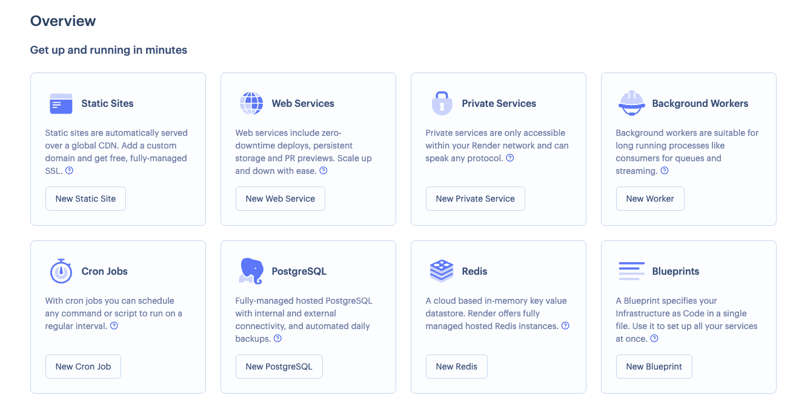

# Render

[Render](https://render.com/) is a Zero DevOps Cloud Platform that helps developers and businesses leverage their most precious resources – time and talent – to build better products faster, delivering more value to their customers with every commit.

## Key Offerings
- PaaS solution as a developer platform to take care of all infrastructure needs away from developers 
- Offers to use IaaC to build static websites, Managed PostgreSQL, Managed Redis, and more.

## Render Dashboard
