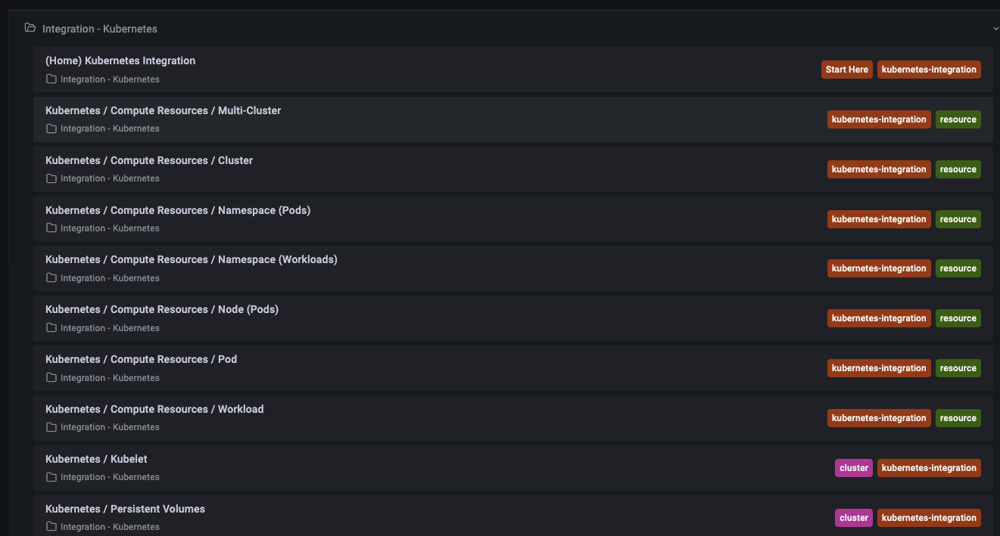

# Grafana
- [Grafana](https://grafana.com/) is an opensource observability tool to query and visualize the data using interactive dashboards, etc.
- Grafana is one of the most popular companion solution with Prometheus, which can be queried from Grafana.
- Grafana supports other time-series databases like Prometheus,  InfluxDB, and Graphite, monitoring platforms such as Sensu, Icinga, Checkmk,Zabbix, Netdata, and PRTG; SIEMs such as Elasticsearch and Splunk; and other data sources.
- GitHub Repo: https://github.com/grafana/grafana
- Developer: **Grafana Labs**, Language: Go
# Cloud Offering
- Grafana offers managed service as a cloud offering. You can register for Free to use **Grafana Cloud** using GitHub or Google account credentials by [clicking here](https://grafana.com/auth/sign-in/?plcmt=top-nav&cta=myaccount).
- Check out [Pricing](https://grafana.com/pricing/) here. Their Free tier offers 3 users, 14 day retention, Synthetic, and Alerting with **10k metrics + 50GB logs + 50GB traces**.
- Pro has Grafana ML, SSO/SAML integration, Query caching, Reporting, Data source permissions, etc.


# Monitoring Kubernetes (Local Cluster - Grafana on Cloud)
- My URL: https://ankurkumarz.grafana.net/
- Refer to full [documentation here](https://ankurkumarz.grafana.net/a/grafana-easystart-app/kubernetes).
- Install the Agent in Kubernetes default cluster
```
MANIFEST_URL=https://raw.githubusercontent.com/grafana/agent/main/production/kubernetes/agent-bare.yaml NAMESPACE=default /bin/sh -c "$(curl -fsSL https://raw.githubusercontent.com/grafana/agent/release/production/kubernetes/install-bare.sh)" | kubectl apply -f -
```

- Run the following commands to install kube-state-metrics:
```
helm repo add prometheus-community https://prometheus-community.github.io/helm-charts && helm repo update && helm install ksm prometheus-community/kube-state-metrics --set image.tag=v2.2.0
```
- Configure and restart the agent (instructions in above doc link)

# K8S Default Dashboards



# Key Findings
- Grafana is a de facto standard for visualization with real-time timeseries database like Prometheus
- Key competition: Elastic's Kibana, Cloud-providers native experience (e.g. AWS CloudWatch, Azure Monitor) or Observability/APM solutions like Dynatrace, New Relic, Splunk, etc.
- Grafana can be integrate with all the above tools to visualize data in a single place.
- Grafana key integrators:
  - [Monitor Azure Services using Grafana](https://docs.microsoft.com/en-us/azure/azure-monitor/visualize/grafana-plugin)
  - 
- Fully-managed Grafana services are being offered by:
  - [AWS Fully Managed Service](https://aws.amazon.com/grafana/)
  - Grafana Labs signed partnership with Microsoft Azure to deliver first-party Grafana Service. [Click here](https://grafana.com/about/press/2021/11/10/grafana-labs-and-microsoft-partner-to-deliver-new-first-party-microsoft-azure-service/) to read more.

- End-to-end Observability
  - Visualization with Grafana
  - Metrics with Prometheus and Graphite
  - Logs with Loki
  - Traces with Tempo