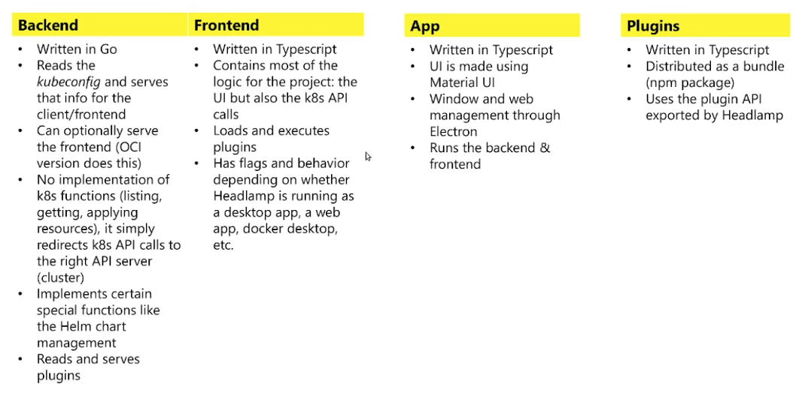
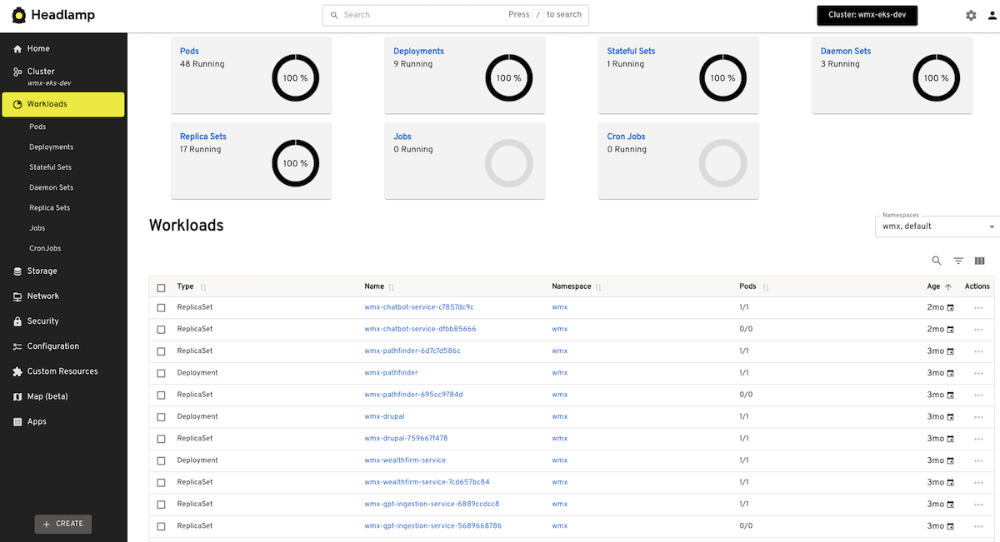

## Context

- [Headlamp](https://headlamp.dev/) is a user-friendly Kubernetes UI focused on extensibility.
- As [Lens](https://k8slens.dev/) is not allowed any longer for professional usage, Headlamp is a good alternative for managing K8S clusters from your local desktop.
- It is supported on Windows, Linux, and MacOS.
- It is a [CNCF Sandbox](https://www.cncf.io/projects/headlamp/) project, contributed to Open source community by Microsoft.
- [GitHub Repo](https://github.com/headlamp-k8s/headlamp/tree/main)
- [Overview Video](https://youtu.be/suxpL2OjAu0)

## Headlamp Architecture

## Headlamp Interface

