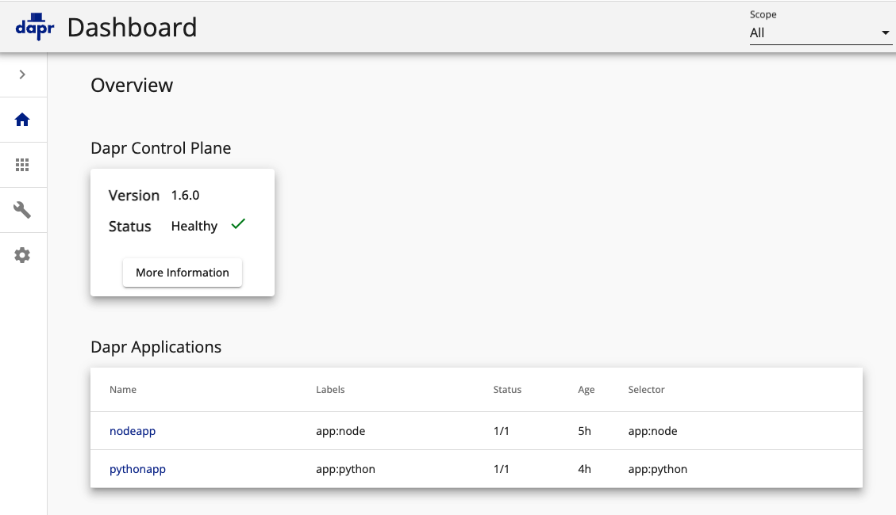
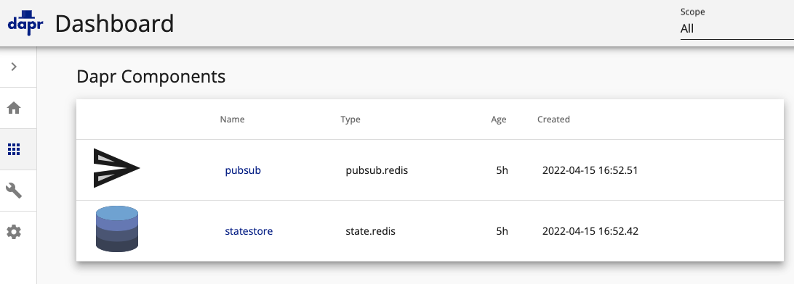

# DAPR
- Dapr is a portable, event-driven runtime that makes it easy for any developer to build resilient, stateless and stateful applications that run on the cloud and edge and embraces the diversity of languages and developer frameworks. 
- The Distributed Application Runtime (Dapr) provides APIs that simplify microservice connectivity.
- Dapr’s sidecar take care of the complex challenges such as service discovery, message broker integration, encryption, observability, and secret management

# Architecture


# Sample Reference Application


[Source](https://github.com/dapr/quickstarts/tree/v1.6.0/hello-kubernetes)

# Local Installation (using Kubernetes)

- Step 1: Install DAPR CLI library. [Click here](https://docs.dapr.io/getting-started/install-dapr-cli/) to read more.

```
brew install dapr/tap/dapr-cli
```

- Setup DAPR on K8S Cluster (creates a namespace). [Click here](https://docs.dapr.io/operations/hosting/kubernetes/kubernetes-deploy/) for detailed instructions for different K8S setup (AKS, EKS, GKE).
```
dapr init --kubernetes --wait
```
- Verify Installation
```
dapr status -k
kubectl get pods --namespace dapr-system
```

## DAPR State Store & Pub/Sub
- DAPR needs a state store (you can use Redis, CosmosDB, DynamoDB, Cassandra, etc.)
- Create and configure a state store with REDIS
```
helm repo add bitnami https://charts.bitnami.com/bitnami
helm repo update
helm install redis bitnami/redis
```
- Create 2 files to install REDIS:redis-state.yaml, redis-pubsub.yaml (as per details [here](https://docs.dapr.io/getting-started/tutorials/configure-state-pubsub/#step-1-create-a-redis-store))
- Install in K8S 
**quickstarts/tutorials/hello-kubernetes/deploy**
```
kubectl apply -f redis-state.yaml
kubectl apply -f redis-pubsub.yaml
```

## DAPR with Docker (No K8S)
- Run DAPR with docker
```
dapr init
dapr run --app-id myapp --dapr-http-port 3500
```
These tell Dapr to use the local Docker container for Redis as a state store and message broker (~/.dapr/components)

- Remove Dapr containers
```
dapr uninstall
```

## DAPR UI Dashboards
- Run to access DAPR UI Dashboard (-k for Kubernetes)
```
dapr dashboard -k -n <your-namespace>.
```


# Key Takeaways
- DAPR usage is more to provide developer decoupled runtime to address service-to-service communication, state management for stateful services, PUB/SUB for event-driven services, observability at fine-grained level, and related needs.
- For example, you can also directly use REDIS in your application code for state management but DAPR runtime provides abstraction so that you don't have to worry about integration with state store. You will simply interface with DAPR and if there is need to change from REDIS to cloud-provider managed state such as DynamoDB, AWS DynamoDB, it can happen without any code change.
- More suitable for large-scale distributed applications using Microservices architecture


# DAPR vs. Service Mesh
- DAPR is more developer centric and Service mesh is more infrastructure centric
- If you need encrypted communication between services, need to use Service Mesh
- [Click here](https://docs.dapr.io/concepts/service-mesh/) to read the official documentation


# References
- [Baeldung example with Spring Cloud Gateway (without Kubernetes](https://www.baeldung.com/dapr-spring-cloud-gateway)
- [DAPR Tutorials](https://github.com/dapr/quickstarts/tree/master/tutorials/hello-kubernetes)