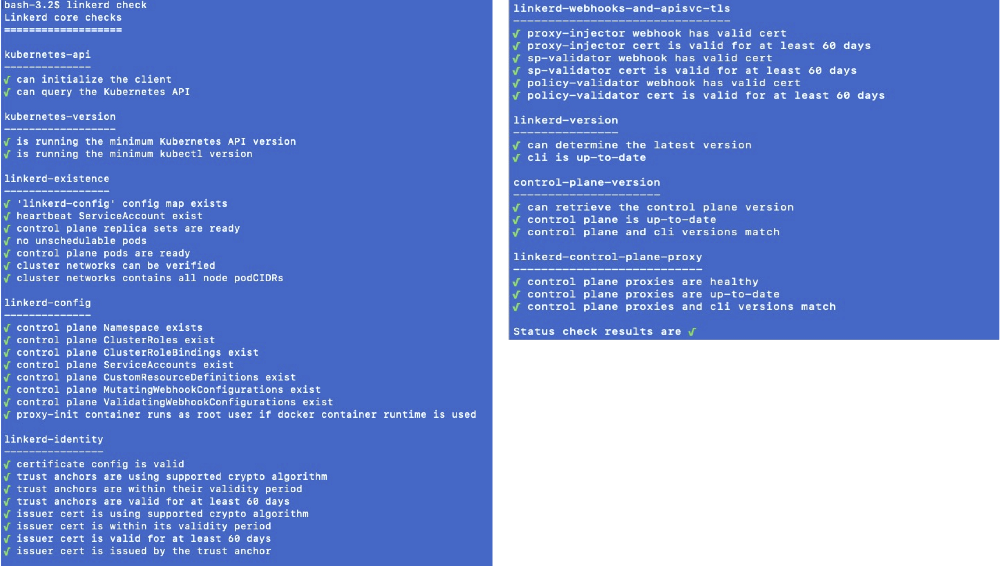
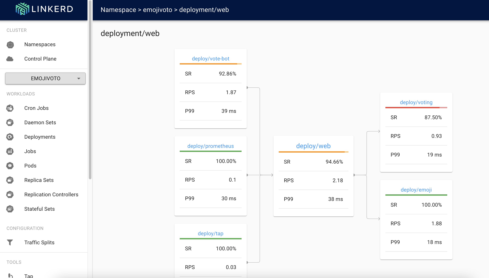

# Linkerd

## Architecture_Diagram


source: https://linkerd.io/2.11/reference/architecture/

## Local Installation
- Install Linkerd CLI:
```
brew install linkerd
linkerd version
```
- Verify K8S Cluster & Install:
```
linkerd check --pre
linkerd install --set proxyInit.runAsRoot=true | kubectl apply -f -
kubectl get po --namespace=linkerd
```
- Check Linkerd Installation:
```
linkerd check
```


- Installation viz extension, which provides observability and visualization
```
linkerd viz install | kubectl apply -f -
linkerd viz dashboard &
```

- Install Demo App in emojivoto namespace:
```
curl --proto '=https' --tlsv1.2 -sSfL https://run.linkerd.io/emojivoto.yml \
  | kubectl apply -f -

## injecting linkerd proxies
kubectl get -n emojivoto deploy -o yaml \
  | linkerd inject - \
  | kubectl apply -f -

kubectl -n emojivoto port-forward svc/web-svc 8080:80

## to verify
linkerd -n emojivoto check --proxy
```
## check the dashboard
- Link: http://localhost:50750/namespaces/emojivoto/deployments/web



## Key Takeaways
- Installation process is very simple and "linkerd" CLI has made it very easy to install.
- Linkerd CLI "linked check" is very useful for any configuration mismatch and prerequisites.
