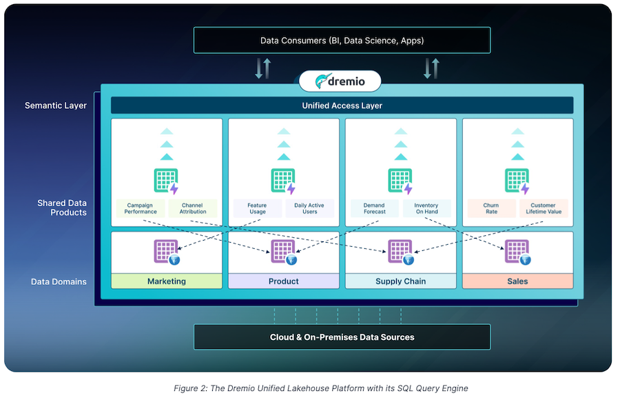

# Dremio

- [Dremio](https://www.dremio.com/) is a data virtualization platform that allows you to connect to and query data from various sources, including databases, cloud storage, and APIs.
- Dremio is a good alternative to Databricks for querying data.
- Dremio is open source and available on [GitHub](https://github.com/dremio/dremio).
- Dremio uses open source libraries for various components. Apache Arrow is used for data encoding. Apache Parquet is used for storage. 
- Started as a query engine has evolved to support data lake capabilities.

## Architecture

## Local Setup

