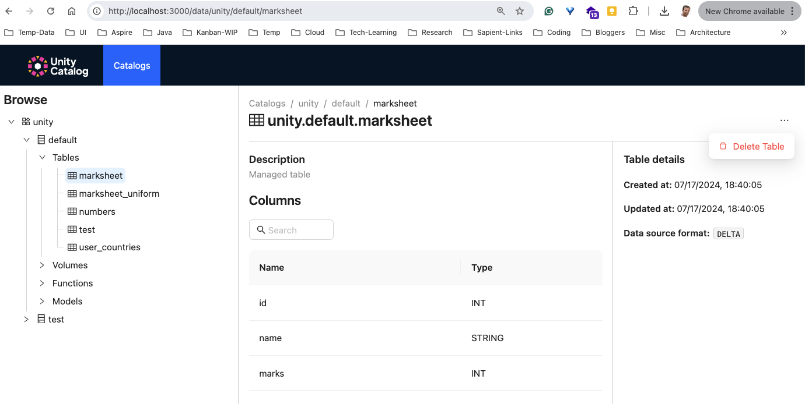

# Unity Catalog

- Unity Catalog is a unified data management service for Databricks. It allows you to manage your data across Databricks workspaces and Databricks SQL warehouses.
- Databricks open sourced Unity Catalog in [June 2024](https://www.databricks.com/blog/open-sourcing-unity-catalog).
- [Unity Catalog on GitHub](https://github.com/unitycatalog/unitycatalog)
- [Unity Catalog Website](https://www.unitycatalog.io/)

# Local Setup

- Cloned from the [GitHub repo](https://github.com/unitycatalog/unitycatalog)

```
bin/start-uc-server
```

- UI is separate NodeJS app and need to be started separately. Current observation is UI is very basic, not very useful. You can't do any write operations through the UI.

```
cd ui -- ../sandbox/data/unitycatalog/ui
yarn install
yarn start
```



- You can use integration with DuckDB to query Unity Catalog tables.
- From Duck, you can query but can't write.
- Other option is to use Unity catalog's utility CLI `uc` to load/query data into Unity Catalog tables:

```
bin/uc table create --full_name unity.default.test    --columns "some_numbers INT, some_letters STRING"     --storage_location ./sandbox/data/unitycatalog/etc/data/external/unity/default/tables/ 

bin/uc table get --full_name unity.default.numbers
```
