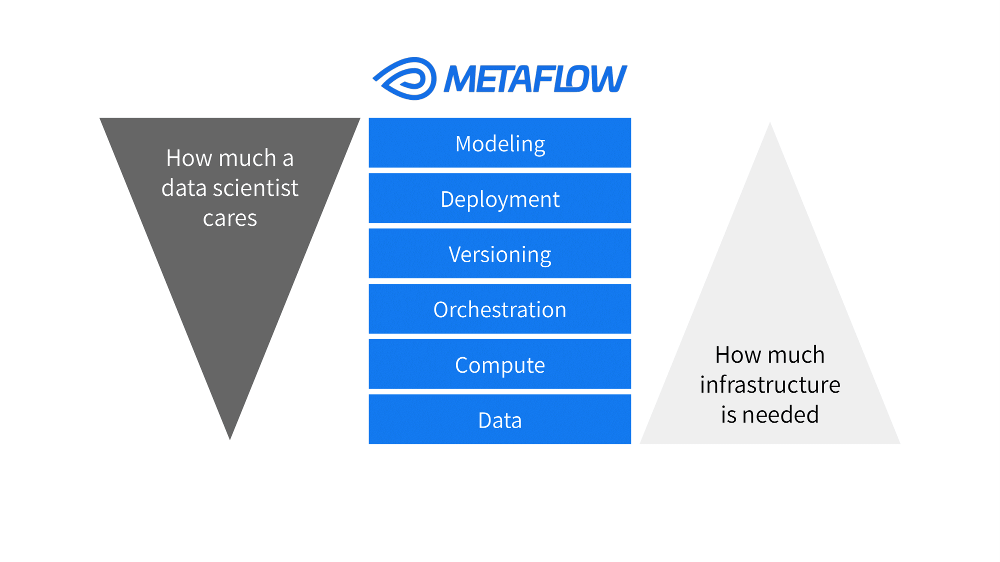

## Metaflow

- [Metaflow](https://metaflow.org/), built by Netflix and open-sourced in 2019. [Reference Blog](https://netflixtechblog.com/open-sourcing-metaflow-a-human-centric-framework-for-data-science-fa72e04a5d9)
-  It is a Python library that helps developers and data scientists build, deploy, and run data-intensive applications.
- Metaflow provides a unified API to the whole infrastructure stack that is required to execute data science projects from prototype to production.
- Technologies Integration: 
    - **Modeling** (Python libs)
    - **Deployment** (Argo Workflows, Step Functions, Apache Airflow)
    - **Versioning** (Local Metadata, Metadata Service)
    - **Orchestrator** (Local Orchestrator)
    - **Compute** (Local Processes, AWS Batch, Kubernetes)
    - **Data** (Local Datastore, AWS S3, Azure Blob Storage, Google Cloud Storage)



## Local Installation

```
cd sandbox/genai/metaflow
metaflow tutorials pull
metaflow tutorials list
```
