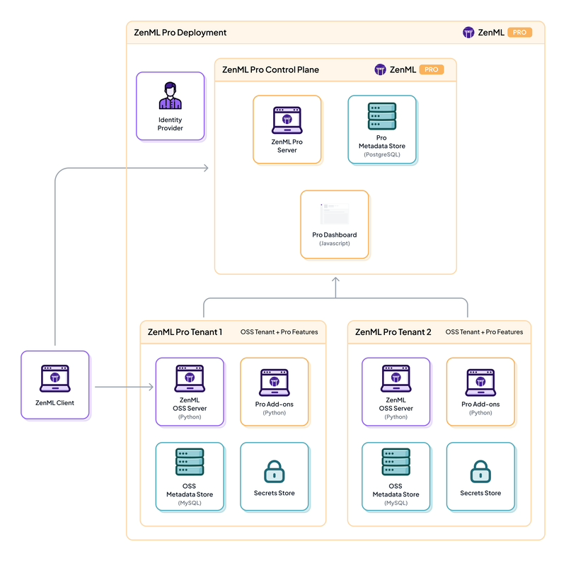

## Context

- [ZenML](https://www.zenml.io/) is an extensible, open-source MLOps framework for creating portable, production-ready MLOps pipelines.
- [GitHub Repo](https://github.com/zenml-io/zenml)
- [Production Guide](https://docs.zenml.io/user-guide/production-guide)
- [ZenML Comparison with Airflow, ClearML, Kedro, Kubeflow, Metaflow, Dagster, etc.](https://www.zenml.io/compare)
-  [Fine-tuning open source LLMs using MLOps pipelines with PEFT](https://github.com/zenml-io/zenml-projects/tree/main/llm-lora-finetuning)

## Quickstart Guide

- For Opensource:

```
cd ../sandbox/genai/zenml
pyenv global 3.11
python -m venv .venv
source .venv/bin/activate
pip install "zenml[server]" notebook
export OBJC_DISABLE_INITIALIZE_FORK_SAFETY=YES
zenml login --local
zenml go -- Quickly explore ZenML with this walk-through
```

## Running a Pipeline

## Architecture


