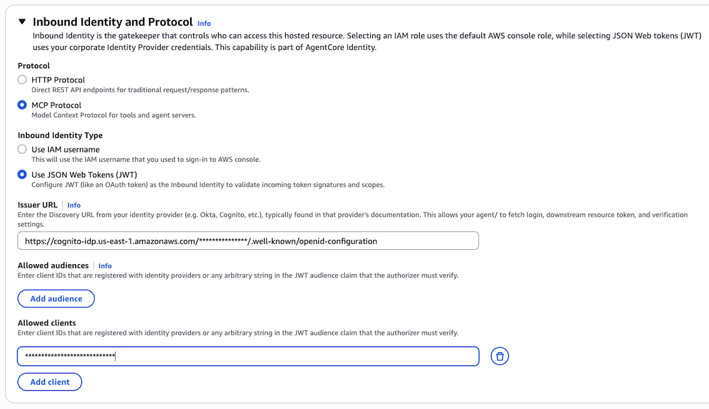

## AgentCore Runtime

- [AgentCore Python SDK](https://github.com/aws/bedrock-agentcore-sdk-python)

## Hosting an MCP Server

- Configure Cognito User Pool (AgentCore Agents and MCP Servers need to be authenticated). Users in the pool need permission to invoke, which is configured in the Agent Configuration itself (See below)


- Once Agent or MCP server is configured, generate the BEARER TOKEN using the approach: https://docs.aws.amazon.com/bedrock-agentcore/latest/devguide/runtime-mcp.html

```
export BEARER_TOKEN=$(aws cognito-idp initiate-auth \
  --client-id "$CLIENT_ID" \
  --auth-flow USER_PASSWORD_AUTH \
  --auth-parameters USERNAME='testuser',PASSWORD='PERMANENT_PASSWORD' \
  --region us-east-1 | jq -r '.AuthenticationResult.AccessToken')
```

## Code Examples

- [Amazon Bedrock AgentCore Samples - AWSLabs](https://github.com/awslabs/amazon-bedrock-agentcore-samples)

## Blogs

- [Scale your agents and tools on Amazon Bedrock AgentCore Runtime](https://aws.amazon.com/blogs/machine-learning/securely-launch-and-scale-your-agents-and-tools-on-amazon-bedrock-agentcore-runtime/)