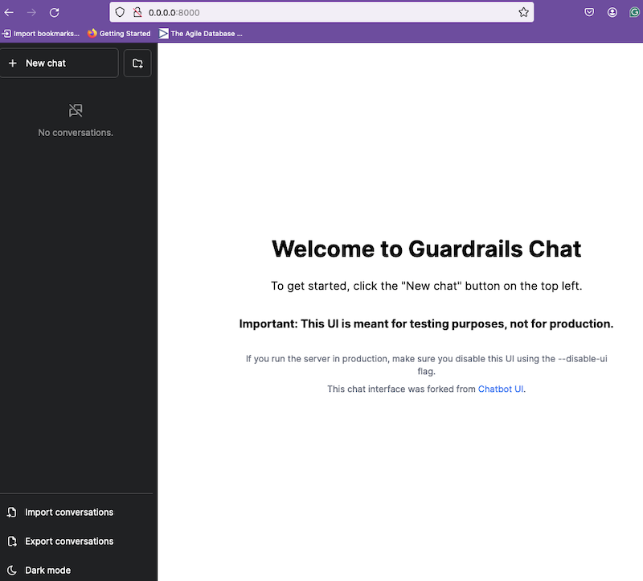

# NeMo-Guardrails

- Nemo guardrails provides

- [NeMo Guardrails](https://github.com/NVIDIA/NeMo-Guardrails) is an open-source toolkit, built by NVIDIA, for easily adding programmable guardrails to LLM-based conversational systems.
- It is built using LangChain and supports integrated guardrails for LangChain applications.
- It offers Chat, Server, and Library interface to experiment with Guardrails.
- [Click here](https://github.com/NVIDIA/NeMo-Guardrails/blob/develop/docs/getting_started/1_hello_world/README.md) for starter kit.

## Getting Started / Setup

- Install in your Python environment:

```
pip install nemoguardrails
```

## Chat Experience

- To launch chat experience using CLI:

```
nemoguardrails chat --config /Users/ankkumar/sandbox/genai/nemo/NeMo-Guardrails//docs/getting_started/4_input_rails/config
```

- To launch chat experience using Web UI:

```
nemoguardrails server --config /Users/ankkumar/sandbox/genai/nemo/NeMo-Guardrails//docs/getting_started/4_input_rails/config
```

