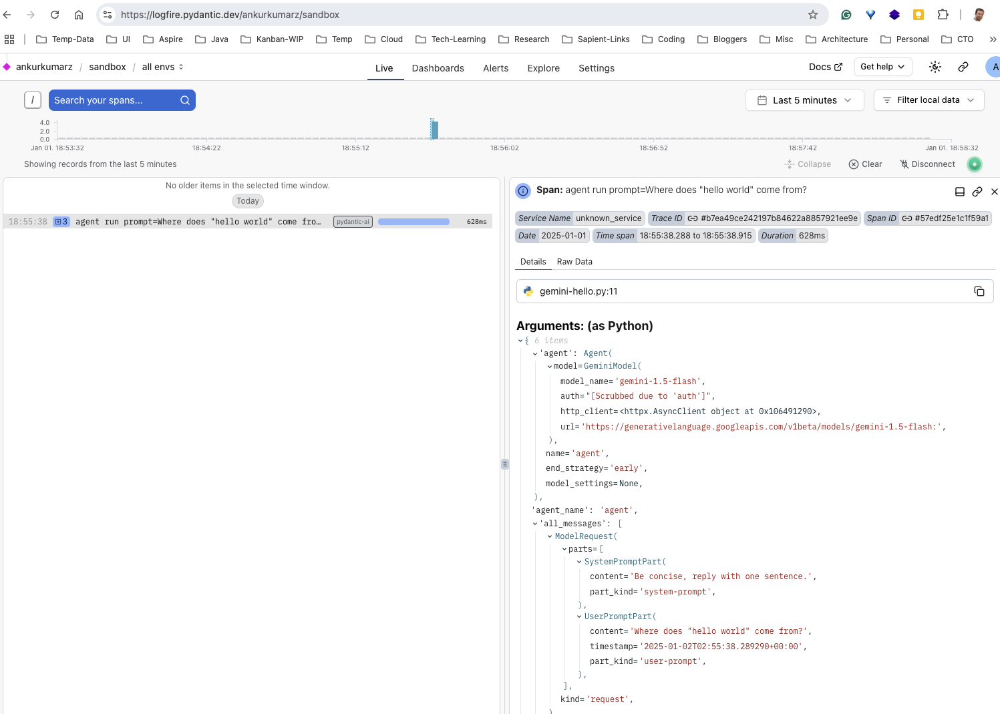

## Context

- [PydanticAI](https://ai.pydantic.dev/) is a Python-based AI framework, created by Pydantic Team applying FastAI-like development experience for building AI Apps.
- Supports OpenAI, Anthropic, Gemini, Ollama, Groq, and Mistral, and more.
- Provides integration with [Logfire](https://pydantic.dev/logfire) - an observability solution built by Pydantic team.
- [GitHub Repo](https://github.com/pydantic/pydantic-ai)
- Multi-agent Apps using PydanticAI covering complexity such as:
  - *Single agent workflows*
  - *Agent delegation* — agents using another agent via tools
  - *Programmatic agent hand-off* — one agent runs, then application code calls another agent
  - *Graph based control flow* — for the most complex cases, a graph-based state machine can be used to control the execution of multiple agents

## Local Setup with Examples

- Setup Pydantic AI and install examples
```
cd genai/pydanticai
pip install 'pydantic-ai[examples]'
pip install 'pydantic-ai[logfire]'
export GEMINI_API_KEY=<TOKEN>
export LOGFIRE_TOKEN=<TOKEN>
```

- Generate Gemini API Key from [Google AI Studio](https://aistudio.google.com/)
- Create Logfire Token from [Console](https://logfire.pydantic.dev/ankurkumarz/)
- Use below code:

```
from pydantic_ai import Agent
import logfire
logfire.configure()  
logfire.instrument_asyncpg() 

agent = Agent(  
    'gemini-1.5-flash',
    system_prompt='Be concise, reply with one sentence.',  
)

result = agent.run_sync('Where does "hello world" come from?')  
print(result.data)
"""
The first known use of "hello, world" was in a 1974 textbook about the C programming language.
"""
```

## Pros/Cons

**Pros**

- Promising with simplicity and familiar Pydantic model-like coding interface, Type-safety checks, etc.
- Lightweight framework (not overloaded like LangChain)
- Use-cases such as RAG, Chat App-like apps
- Supports Slim installation to avoid additional packages:

```
'pip/uv install/add pydantic-ai-slim[openai]'
```

- [Multi-agent support](https://ai.pydantic.dev/multi-agent-applications/#agent-delegation). See flight booking example - https://ai.pydantic.dev/examples/flight-booking/

**Cons**

- Early days for the framework, still BETA. Framework to expand covering complex use-cases.
- Graph RAG and others are evolving.

## User Experience



