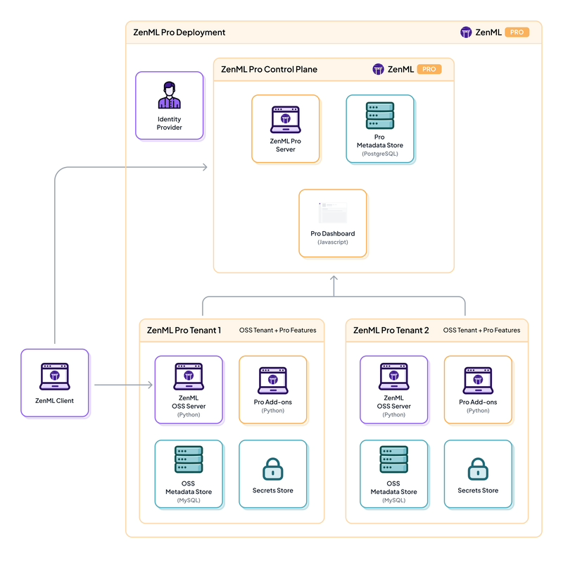

---
title:ZenML
---

## Context

- [ZenML](https://www.zenml.io/) is an extensible, open-source MLOps framework for creating portable, production-ready MLOps pipelines.
- [GitHub Repo](https://github.com/zenml-io/zenml)
- [Production Guide](https://docs.zenml.io/user-guide/production-guide)
- [ZenML Comparison with Airflow, ClearML, Kedro, Kubeflow, Metaflow, Dagster, etc.](https://www.zenml.io/compare)

## Quickstart Guide

- For Pro version:

```
cd sandbox/genai/zenml/zenml/examples/quickstart
python -m venv .venv && source .venv/bin/activate
pip install "zenml==0.70.0"
git clone --depth 1 https://github.com/zenml-io/zenml.git && cd zenml/examples/quickstart
pip install -r requirements.txt

zenml login <<tokenid>>
```

- For Opensource:

```
cd ../sandbox/genai/zenml/zenml
zenml go
```

## Running a Pipeline

## Architecture


