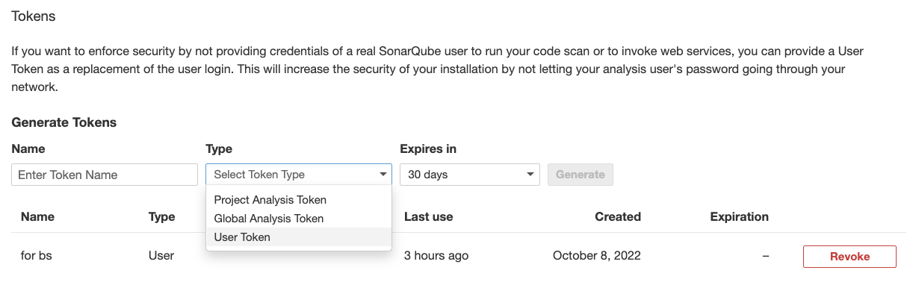
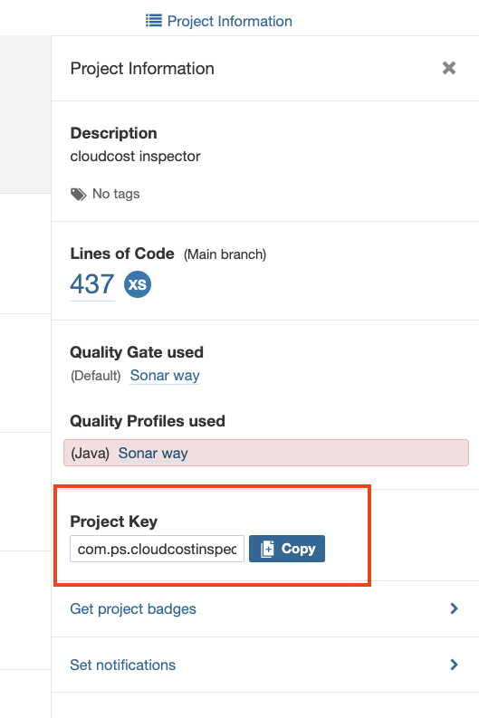
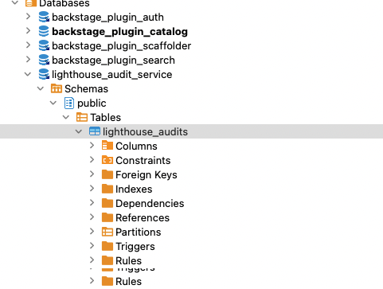

# Backstage
- [Backstage](https://backstage.io/), developed by Spotify, is an open platform for building developer portals.
- You can centralize software catalog, microservices catalog, infrastructure tooling, documentation (ADRs), etc. in a single place.
- [Click here](https://engineering.atspotify.com/2020/04/how-we-use-backstage-at-spotify/) to read the Spotify blog post providing overview.
- GitHub: https://github.com/backstage/backstage

Demo

- **Online Demo**: https://demo.backstage.io


# Local setup
- Guide: https://backstage.io/docs/getting-started/
- Crate a new backstage app using npx:
```
npx @backstage/create-app
yarn dev
```
- Local URL: http://localhost:3000
- Setting up database:
```
brew install postgresql
brew services restart postgresql@14 or /usr/local/opt/postgresql@14/bin/postgres -D /usr/local/var/postgresql@14

#Login in local postgresql
psql postgres -- to check postgres connection
CREATE USER backstage WITH PASSWORD 'secret' CREATEDB LOGIN
```
- Update configuration to use database:
```
yarn add --cwd packages/backend pg
```
- Update app-config.yaml:
```
 database:
    #client: better-sqlite3
    #connection: ':memory:'
    client: pg
    connection:
      host: 'localhost'
      port: 5432
      user: backstage
      password: ****
```

## Key Plugins
A plugin might needs to be installed on frontend as well as backend (NodeJS) applications.

- TechDocs
- [SonarQube](https://github.com/backstage/backstage/blob/master/plugins/sonarqube/README.md)
- [Jenkins](https://github.com/backstage/backstage/tree/master/plugins/jenkins)
- [Google Lighthouse](https://github.com/backstage/backstage/tree/master/plugins/lighthouse)
- [ADR](https://github.com/backstage/backstage/tree/master/plugins/adr)
- [ADR Backend](https://github.com/backstage/backstage/blob/master/plugins/adr-backend/README.md)
- [Cost Insights](https://github.com/backstage/backstage/blob/master/plugins/cost-insights/src/example/templates/CostInsightsClient.ts)
- Sometimes plugin installation does not work. Use below:
```
yarn install --check-files
yarn tsc
```

## Configuring Sonar
- [Install Sonar Frontend Plugin](https://github.com/backstage/backstage/tree/master/plugins/sonarqube)
- [Install Sonar Backend Plugin](https://github.com/backstage/backstage/tree/master/plugins/sonarqube-backend)
- Generate User Token from Sonar (Login Required): My Account -> Security (snapshot below)
  - Sonar API works without any password if you have the user token

- Ensure that plugin got installed correctly by running following - it should be in :
```
yarn tsc
find . -name '*sonar*'
```
- You should see following files:
```
./node_modules/@backstage/plugin-sonarqube
./node_modules/@backstage/plugin-sonarqube-backend
./packages/backend/src/plugins/sonarqube.ts
```
- Get the Sonar Project Key from **Dashboard** -> *Project* -> Project Information (see below)

- Update sonar settings in *app-config.yaml*:
```
sonarqube:
  instances:
    - name: default
      baseUrl: http://localhost:9000
      # API Key is the user token generated from Sonar
      apiKey: ************
```
- Put the configuration in your project *catalog-info.yaml*:
```
  annotations:
    backstage.io/techdocs-ref: dir:.
    jenkins.io/job-full-name: "devlocal:cloudcost-inspector"
    sonarqube.org/project-key: "com.ps.cloudcostinspector:CloudCostInspector"
```


## Configuring TechDocs
- TechDocs is Spotify’s homegrown docs-like-code solution built directly into Backstage. 
- It uses [MkDocs](https://www.mkdocs.org/) as the underlying engine as static site generator.
- You can generate documents outside the Backstage (separate CI/CD)
- Detailed instructions are [here](https://backstage.io/docs/features/techdocs/getting-started#disabling-docker-in-docker-situation-optional):
- [TechDocs configuration options](https://backstage.io/docs/features/techdocs/configuration)

```
brew install graphviz
brew install plantuml
pip install mkdocs
pip install mkdocs-techdocs-core==1.1.7
techdocs-cli serve --no-docker --for testing docs
```
## Configure Lighthouse
- You need to install Lighthouse Plugin
- Lighthouse Audit Service is a separate Microservice, created by [Spotify](https://github.com/spotify/lighthouse-audit-service). This needs to run separately as a container. [See instructions here.](https://roadie.io/blog/backstage-lighthouse-plugin/)
- You need to create a DB Schema in PostgreSQL (see below diagram), and Run Lighthouse audit service
- Backstage URL: http://localhost:3000/lighthouse

- the sidebar is managed inside packages/app/src/components/Root/Root.tsx

## Configuring Jenkins