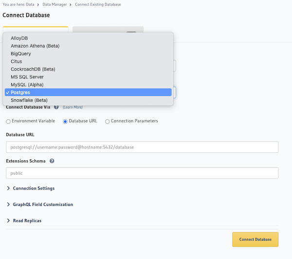
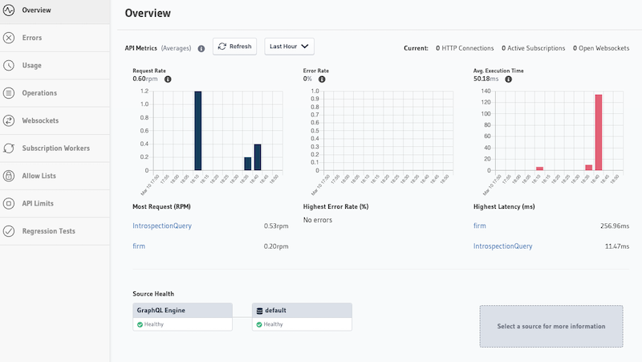

# Context

- [Hasura](https://hasura.io/) is a [Opensource GraphQL engine](https://github.com/hasura/graphql-engine) and a developer platform, which can generate GraphQL API directly from the database.
- It has built-in support for authorization and caching acclerating developer's productivity.
- Hasura offers a managed service (public cloud hosted) for easy access.

> Hasura has raised $100M Series C funding in February 2022 ([source](https://techcrunch.com/2022/02/22/graphql-developer-platform-hasura-raises-100m-series-c/))

## Setup

- Cloud-managed service by Hasura: https://cloud.hasura.io/
- It can be deployed to Azure, Google Cloud, AWS, Render and others.
- It provides creating a database (Postgres) in partnership with [Neon](https://neon.tech/).
- You can connect below databases:

## Pros/Cons

Pros:
- Helps to acclerate development considering the easy way to create GraphQL based API from the database
- Provides out-of-the-box caching, monitoring, custom queries (Actions), event-based processing (Event Trigger), and more.

Cons/Cautions:
- For financial services, connectivity with Hasura-managed Cloud will be a concern. Alternatively, it can hosted by the enterprise.
- Scalability and support in case of production issue (considering the scale of the organization)
- Good for simple use-cases exposing data as CRUD, need to explore more on complex business-logic components.

## Hasura Console

- Interface to publish API:

## Architecture Patterns

- Event Triggers (captures events (insert, update, delete) on a specified table and then reliably calls a HTTP webhook to run some custom business logic)

- Custom queries or mutations:
