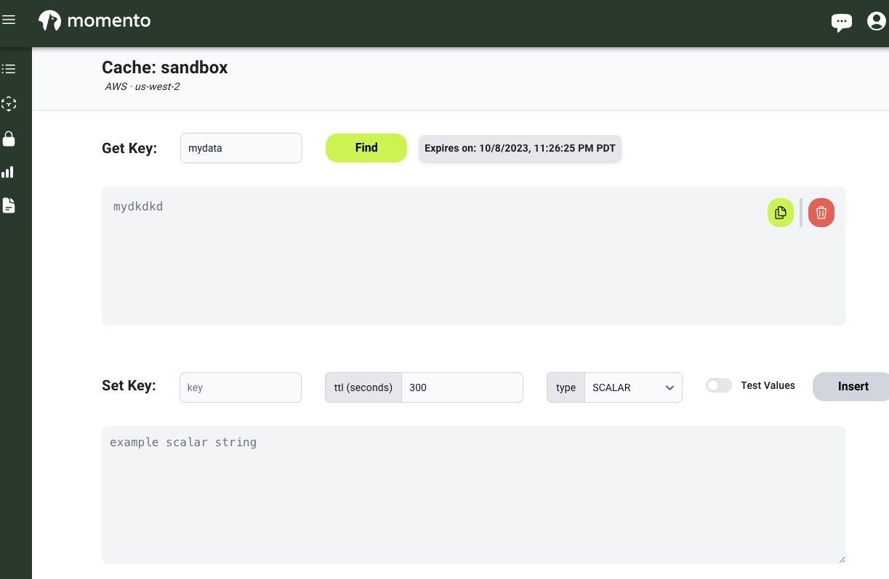

# Momento

## Context

- [Momento](https://www.gomomento.com/) is a Serverless Data Platform focused on providing minimal effort to create Cache and Pub/Sub ([Topics](https://docs.momentohq.com/topics)) services in Cloud.
- It is also working on providing Vector Index (not database) as a service for Gen AI.
- You can choose the Cloud Service Provider (AWS & GCP supported).
- When you publish an item to a topic, if it does not exist yet, the topic is created. As Topics utilizes Momento Cache, there is no scaling configuration either.
- It provides SDK in more than 10+ languages.
- It provides Free tier (first 5 GB/month, 100 TPS Max).

## Momento Console

- [Console Link](https://console.gomomento.com/)
- Registered with GitHub credentials

## Create a Cache


## List Cache




## Publish/Subscribe to Topic with Cache


## Installation Local for CLI
```
brew tap momentohq/tap
brew install momento-cli
momento configure --quick
momento cache set key value --ttl 100 --cache example-cache
momento cache get key --cache example-cache
```

## Documentation

- [CLI Documentation](https://github.com/momentohq/momento-cli)
- [Developer Documentation](https://docs.momentohq.com/cache/develop/)
