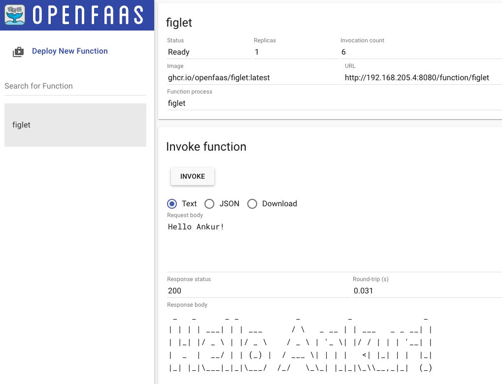

# OpenFaaS

## Context
- OpenFaaS makes it easy for developers to deploy event-driven functions and microservices to Kubernetes without repetitive, boiler-plate coding. 
- Supports Opensource framework avoiding vendor lock-in
- Write functions in any language and package them in Docker/OCI-format containers
- Supports [PLONK](https://www.openfaas.com/blog/plonk-stack/) (Prometheus, Linkerd/Linux, OpenFaas, NATS, K8S) technology stack:

- Conceptual flow:

## Local setup

- Installed [Multipass](https://multipass.run/) on MAC (instead of using Docker, it is lightweight). Test Multipass using:
```
multipass launch --name foo
multipass exec foo -- lsb_release -a
multipass list
```
- Create a Cloud Config File and replace the SSH Key:
```
curl -sSLO https://raw.githubusercontent.com/openfaas/faasd/master/cloud-config.txt
cat ~/.ssh/id_rsa.pub
```
- Replace ssh_authorized_keys with above SSH Key
- Launch faasd with Multipass:
```
cat cloud-config.txt | multipass launch --name faasd --cloud-init -
multipass info faasd
```
- Launch the console:
```
export IP=$(multipass info faasd --format json| jq -r '.info.faasd.ipv4[0]')
ssh ubuntu@$IP "sudo cat /var/lib/faasd/secrets/basic-auth-password" > basic-auth-password
export OPENFAAS_URL=http://$IP:8080
```
- Username is **admin** and password is in the **basic-auth-password** file
- Deploy a sample serverless function:
```
cat basic-auth-password | faas-cli login -s
faas-cli store deploy figlet --env write_timeout=1s
echo "faasd" | faas-cli invoke figlet
```
