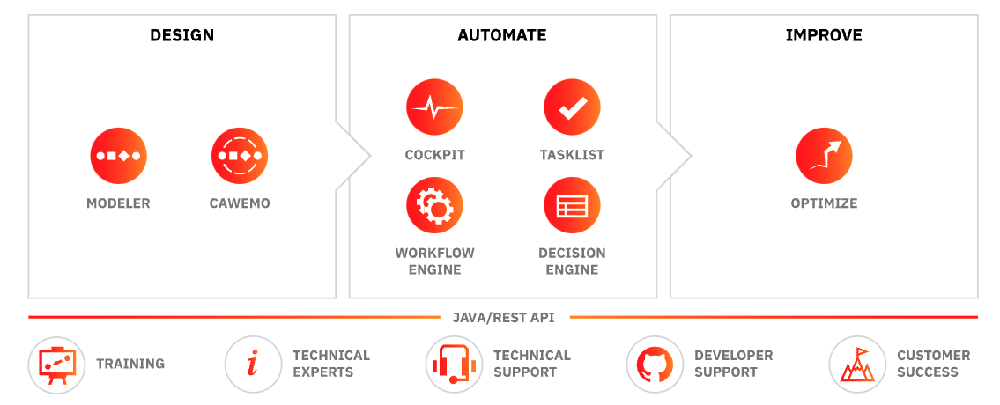
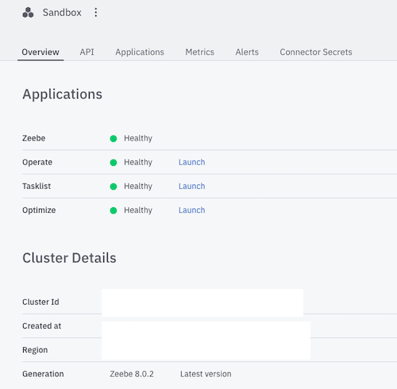
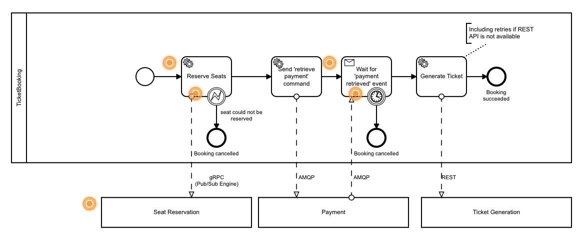

# Camunda
- [Camunda](https://camunda.com/) describes itself as a universal process orchestrator. The most recent version is Camunda Platform 8.
- A workflow management solution  based on [BPMN](https://www.omg.org/bpmn/) and [DMN](https://www.omg.org/dmn/) based modeling framework. 
- It supports both self-managed PaaS-based deployment and SaaS-based deployment model.
- Underlying architecture is using Microservices & Cloud-native oriented architecture replacing traditional Traditional business process management suites (BPM) systems.
- Camunda has Opensource Modeler (as a desktop app & web), Opensource community edition. See comparison with enterprise edition by [clicking here](https://camunda.com/enterprise/).
- Key offerings of Camunda Platform 8 are [documented here](https://docs.camunda.io/docs/components/concepts/what-is-camunda-platform-8/)
    - Horizontal scalability, high availability, and fault tolerance (with SaaS Model & On-premises/Hybrid Cloud as a separate option)
    - Audit trail of workflows (events-driven)
    - Reactive publish-subscribe interaction model, Visual processes modeled in ISO-standard BPMN 2.0, and Language-agnostic client model.

## Applicability
- Business-process automation examples such as:
    - Financial Services: Automated KYC process for client onboarding (Bank), client engagement process automation 
- Any human-task orchestration
- Orchestrating Microservices
- RPA Bots Orchestration
- Build a Centralized Process Automation Platform. [Read here](https://camunda.com/solutions/process-automation-platform/).

## Architecture
- Overall Technology Stack: Java, Spring Boot, Kafka, gRPC (Zeebee components communication), GraphQL (used by Tasklist), ELK (logs for Zeebee and others)
- GitHub Repository: https://github.com/camunda
- [Platform Components](https://camunda.com/platform/): Zeebe, Modeler, Operate, Tasklist & Optimize.
- [Modeler](https://docs.camunda.io/docs/components/modeler/about-modeler/): Modeling following BPMN/DNM standards visually (web & desktop app)
- [Zeebee](https://docs.camunda.io/docs/components/zeebe/zeebe-overview/) as a cloud-native BPMN Workflow Engine.
- Decision Engine: using DNM as standard.
- [Tasklist](https://docs.camunda.io/docs/components/tasklist/introduction/): for managing human tasks. Tasklist is a ready-to-use application to rapidly implement business processes alongside user tasks in Zeebe.
- [Operate](https://docs.camunda.io/docs/components/operate/): for monitoring real-time, analyze/resolve issues. Operate is a tool for monitoring and troubleshooting process instances running in Zeebe.
- [Optimize](https://docs.camunda.io/docs/components/optimize/what-is-optimize/): for insights into the workflow with visual reports, heatmap, etc.

 
Image Source: https://camunda.com/platform-7/

- Zeebee Architecture:


- Read about Camunda platform reference architecture by [clicking here](https://camunda.com/wp-content/uploads/2020/09/TB-Camunda_Reference_Architecture-092520.pdf):
- Camunda Process Engine is built using Spring Boot. It supports embedded deployment (as a library) or container-managed as an independent container, or standalone process engine server deployed in VM. Docker image is available at [their registry](https://registry.camunda.cloud/) built using Harbor.
-  Camunda recommends Oracle or PostgreSQL for production and H2 for
development. It supports MySQL, MariaDB, IBM DB2, Amazon Aurora, Azure SQL, SQL Server, and CockroachDB as well.

## Alternative Options

## Access/Setup
- Trial: SaaS is available as a free account with collaborative modeling features for unlimited BPMN/DMN models.
- Register to access [Camunda Console](https://console.cloud.camunda.io/) for 1 month trial period
- Camunda Console is available as a free account (trial):


- Installed Camunda Modeler (available as Opensource)

## Sample Applications
- Create a Microservices orchestration flow using the modeler like below:

- You can also use their CLI interface:
```
zbctl create instance "order-process"
```


## Useful Links:
- Downloads: https://camunda.com/download/modeler/
- https://camunda.com/blog/2021/10/start-and-step-through-a-process-with-rest-feat-swaggerui/
- https://github.com/camunda
- https://docs.camunda.io/
- https://docs.camunda.io/docs/guides/orchestrate-microservices/